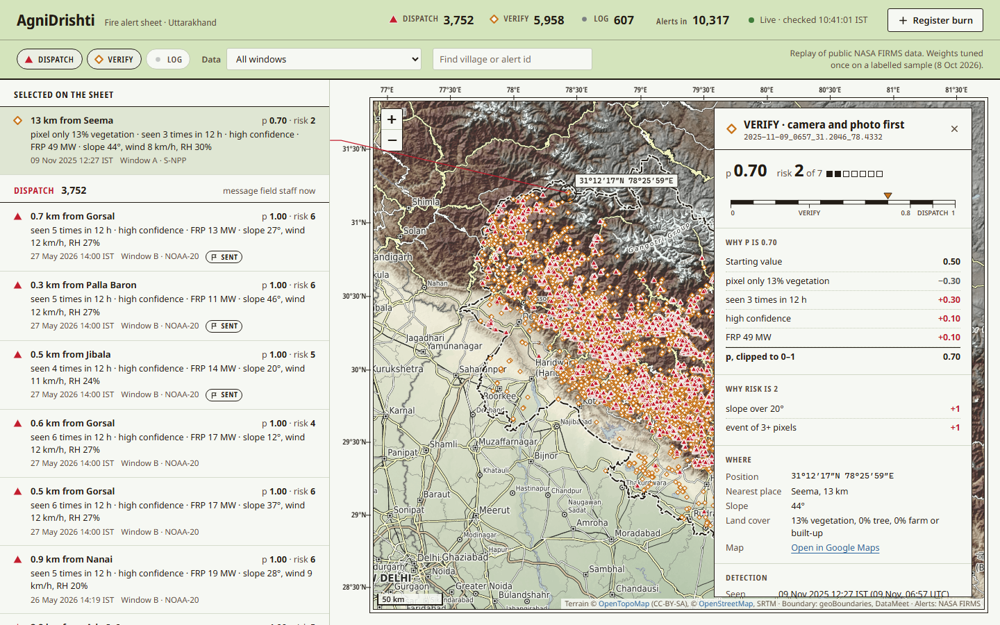

# AgniDrishti

AgniDrishti checks every satellite fire alert before anyone is sent out, so forest staff only go to alerts that are likely to be real, dangerous forest fires.

It does not detect fires itself. It takes NASA FIRMS VIIRS alerts for Uttarakhand, checks each one against land cover, repeat detections, past fires, planned burns, terrain and weather, and sorts it into three tiers, each with plain-language reasons:

- **DISPATCH:** message field staff now (Telegram, plus a CAP 1.2 alert file).
- **VERIFY:** point a camera at it and ask the nearest staff member for a photo first.
- **LOG:** keep it on the dashboard and send no message.

In three winter months Uttarakhand's forest department got 1,957 fire alerts, and 132 were real forest fires. About 39% were fires outside the forest and another 39% found nothing on the ground. AgniDrishti is a verification layer on top of the alerts that already exist. It doesn't replace FSI's feed or the state's dispatch app.



## How it works

1. **Satellite alert.** A FIRMS VIIRS detection: something in a roughly 375 m pixel was hot.
2. **Score.** Explainable rules give a probability that it is a real forest fire (p) and a risk score (r, 0–7). The rules use:
   - ESA WorldCover land cover inside the pixel;
   - repeat detections within 1 km and 12 h;
   - how often the same 500 m cell fired since 2023;
   - the planned-burn register;
   - distance to the nearest village, slope, wind and humidity.

   Every alert gets its reasons, for example "pixel 93% farmland or built-up; 3.6 km from Sitarganj".
3. **Camera check (VERIFY).** The nearest camera runs the Pyronear YOLO11s smoke model on 6 frames. Smoke in 4 of them raises p to 0.9, which makes the alert DISPATCH. In the demo, a phone running IP Webcam stands in for a watchtower camera.
4. **Field photo.** A ranger shares their location with the Telegram bot and sends a photo. A YOLO11n trained on D-Fire comments on the photo, and the ranger's tap records the outcome.
5. **Dashboard.** A map and table of every alert, live, including LOG. Nothing is deleted.

The scoring is rules rather than a trained model on purpose. Forest staff can see why each alert was sent or held back, and 80 labelled alerts are too few to train a model safely. The spec switches to logistic regression on the same features after about 150 labels.

## Results

These come from a replay of 10,314 FIRMS alerts in Uttarakhand (Nov 2025–Jan 2026 and Apr–May 2026). Details are in the Gate 3 report, [docs/phase-3-prove-it.md](docs/phase-3-prove-it.md).

| Measure | Result |
| --- | --- |
| Staff sent to fewer alerts (full replay) | **64% fewer** (3,751 DISPATCH of 10,314) |
| Real forest fires kept in DISPATCH or VERIFY | **19 of 19** (test half of the labelled sample) |
| Dispatches that were real forest fires | **9 of 9** (test half; 2 more were `unclear`) |
| Camera false confirmations | **2 in 43 min** of cloud, fog and haze footage; 9 of 10 smoke clips caught |
| Satellite alert → camera → Telegram | **53 s** (1 run; the 3-run median is pending) |
| Photo model, D-Fire test split | mAP50 0.742 (smoke 0.802, fire 0.682) |

**How the sample was built:**
- 80 alerts were drawn across the three tiers and labelled from Sentinel-2 before and after images, using the dNBR burn index as a hint.
- Claude pre-labelled them blind to the scores, and a person checked every label.
- The weights were tuned once on 42 alerts and tested once on the other 38.

The results are preliminary. The sample is small and stratified by tier, so its counts describe the sample, not every alert.

## Run it

Windows and Python 3.13. Run everything from the repository root.

```powershell
python -m venv .venv; .venv\Scripts\activate
pip install -r requirements.txt
```

Create `.env` with `FIRMS_KEY` (a free FIRMS MAP_KEY), `BOT_TOKEN` (from @BotFather) and `CHAT_ID` (the staff group). Never commit it.

**Data.** [docs/phase-0-before-day-one.md](docs/phase-0-before-day-one.md) lists the downloads: WorldCover and DEM tiles, OSM places, the state boundary and both models. Then:

```powershell
python pull.py    # FIRMS archive windows
python prep.py    # clip to Uttarakhand, villages, recurrence cells, map outline
python score.py   # features, p, r, tier and reasons -> data/scored.csv
```

**Live demo.** Run each service in its own terminal:

```powershell
uvicorn api:app --host 0.0.0.0 --port 8000                            # camera API + dashboard at http://localhost:8000
python live.py                                                        # rescores data/live.csv every 10 s, sends DISPATCH
python bot.py                                                         # field photo bot
$env:CAMERA_SOURCE="http://<phone-ip>:8080/video"; python node.py     # camera node (a video file also works)
python live.py --inject 5                                             # a demo alert 5 km in front of the camera
```

The full runbook, including the reset between rehearsals, is in [docs/phase-4-freeze-and-demo.md](docs/phase-4-freeze-and-demo.md).

**Self-tests.** Run `python score.py --selftest` and `python geo.py`.

## Repository map

| File | What it does |
| --- | --- |
| `config.py` | Every threshold and weight, with the reason for each tuned value |
| `pull.py`, `prep.py` | FIRMS download; clipping to the state, villages, recurrence cells |
| `check.py`, `score.py` | Features per alert; p, r, tier and reasons |
| `live.py`, `send.py` | Live loop and demo injection; Telegram message and CAP file |
| `api.py`, `web/` | Camera API and the dashboard |
| `node.py`, `bot.py` | Camera node (smoke model); field photo bot |
| `camtest.py`, `s2.py` | Camera false-alarm test; Sentinel-2 dNBR and labelling sheet |
| `docs/` | Phase plans and gate reports, with every measured number |

## Limitations

- **This is a replay of public FIRMS data, not FSI's live alerts.** Live mode polls FIRMS NOAA-20 and NOAA-21 but is off by default.
- **The labelled sample is small (38 test alerts),** and its labels are AI pre-labels checked by one person rather than two independent labellers.
- **WorldCover dates from 2021 and sees vegetation, not legal forest boundaries.** It tags 8.2% of winter alerts as outside forest, against the department's 39%, which splits alerts by Reserve Forest boundary.
- **The camera thresholds were chosen on the same 43 minutes of footage they were scored on,** and the camera has not been tested on Uttarakhand scenery.
- **dNBR is only a hint:** small fires under canopy often leave no visible scar.

## Data, models and licences

| Source | Used for | Licence or terms |
| --- | --- | --- |
| NASA FIRMS (VIIRS S-NPP, NOAA-20, NOAA-21) | Fire alerts | NASA open data; LANCE FIRMS, operated by NASA ESDIS |
| ESA WorldCover 2021 v200 | Land cover | CC BY 4.0, © ESA WorldCover project |
| Copernicus DEM GLO-30 | Slope | Copernicus DEM licence, © DLR e.V. and © Airbus Defence and Space GmbH, provided under COPERNICUS by the EU and ESA |
| OpenStreetMap (Overpass) | Village distances | ODbL, © OpenStreetMap contributors |
| Open-Meteo | Wind and humidity | CC BY 4.0 |
| Sentinel-2 L2A (Earth Search) | Labelling only | Contains modified Copernicus Sentinel data 2025–2026 |
| geoBoundaries IND ADM1 | State boundary | geoBoundaries terms |
| Pyronear YOLO11s `rapid-raccoon_v8.1.0` | Camera smoke model | Apache-2.0 |
| D-Fire dataset (Kaggle copy `sayedgamal99/smoke-fire-detection-yolo`) | Training the photo model | See [DFireDataset](https://github.com/gaiasd/DFireDataset) |
| Ultralytics YOLO | Running both models | AGPL-3.0 |

Test footage from HPWREN (UC San Diego) and Wikimedia Commons is credited clip by clip in [CREDITS.md](CREDITS.md).
